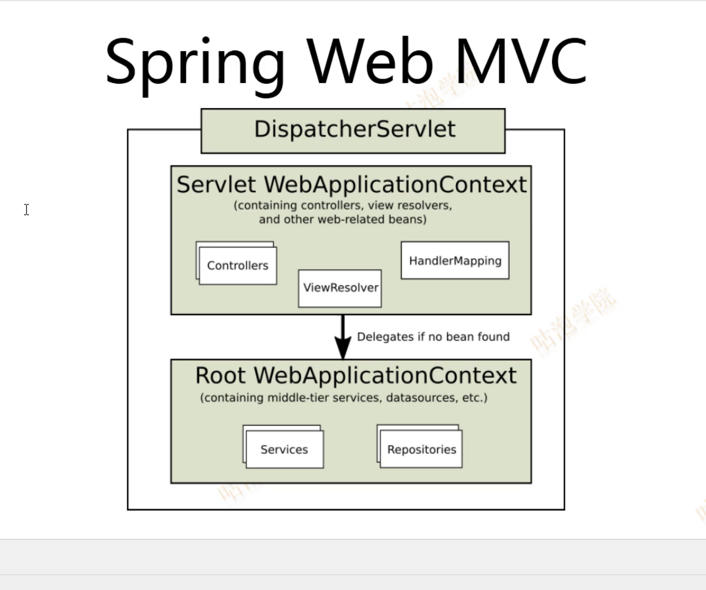

# Spring Web MVC

书籍推荐 《J2EE核心模式》

MVC：

M ： Model

V： View

C： Controller -> DispatchServlet

Front Controlle = DispatchServlet

Application Controller = @Controller  or  (实现)Controller

###  映射处理

ServletContextListener  ->  ContextLoadListener -> Root WebApplicationContext

​						DispatcherServlet     -> Servlet WebApplicationContext

​						Service			-> @Service

​						Repositories		-> @Repository

请求映射

Servlet

/  和  /* 的区别

DispatcherServlet	<   FrameworkServlet	< HttpServletBean	< httpServlet

自动装配：

org.springframework.boot.autoconfigure.web.DispatcherServletAutoConfiguration

Spring Web MVC的配置Bean： WebMvcProperties

**拦截器**：HandlerInterceptor 

return true ;

RequestMethod --> HandlerMethod  处理

preHandle(true) --->     HandlerMethod 执行 （Method# invoke ->）-->

postHandle ---> afterCompletion

postHandle   

### 异常处理

1.  ####  Servlet 标准

    ​	Servlet   web.xml 

2.  #### Spring Web MVC

3.  #### SpringBoot

### 视图技术

### 国际化