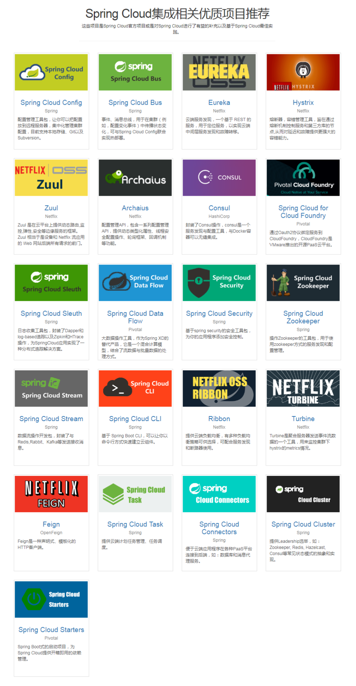

[TOC]

### 1、Spring Cloud 技术体系

#### 1. 前提基础：  

1. 构建系统： Maven、Gradle； 
2. 基础框架：Spring Framework，Spring boot

#### 2. 功能

1. 分布式配置 (Distributed/ versioned Configuration)  Zookeeper 
2. 服务注册与发现(Service registration and discovery)  dubbo /Eureka
3. 路由(Routing)  Rabbio  ()
4. 服务调用(Service-to-Service calls)  feign  Rabbio
5. 负载均衡(Load Balancing)
6. 短路(Circuit Breakers)
7. 分布式消息(Distributed messgaing)

Springcloud 和dubbo 区别：Springcloud 管理应用，  dubbo管理服务 关注点不同

### 2、Spring/Spring Boot 事件机制

#### - 观察者模式

#### - 

### 3、Bootstrap 配置属性 

### 4、理解Environment端点

